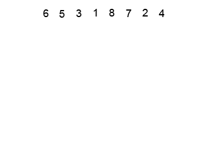

# Description
Heap sort is a efficient comparison-based sorting algorithm.

| Performance | Big O notation |
| --- | --- |
| Worst-case | О(n log n) |
| Best-case | O(n log n) |
| Average | О(n log n) |

## Explanation of work
The Heapsort algorithm involves preparing the list by first turning it into a max heap.
The algorithm then repeatedly swaps the first value of the list with the last value,
decreasing the range of values considered in the heap operation by one,
and sifting the new first value into its position in the heap.
This repeats until the range of considered values is one value in length.

## Example

