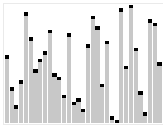

# Description

Quicksort is an efficient divide and conquer algorithm.

| Performance | Big O notation |
| --- | --- |
| Worst-case | О(n log n) |
| Best-case | O(n log n) |
| Average | О(n log n) |

# Explanation of work

It first divides the input array into two smaller sub-arrays: the low elements and the high elements. It then recursively sorts the sub-arrays. The steps for in-place Quicksort are:

1. Pick an element, called a pivot, from the array.
2. Partitioning: reorder the array so that all elements with values less than the pivot come before the pivot, while all elements with values greater than the pivot come after it (equal values can go either way). After this partitioning, the pivot is in its final position. This is called the partition operation.
3. Recursively apply the above steps to the sub-array of elements with smaller values and separately to the sub-array of elements with greater values.

The base case of the recursion is arrays of size zero or one, which are in order by definition, so they never need to be sorted.

The pivot selection and partitioning steps can be done in several different ways; the choice of specific implementation schemes greatly affects the algorithm's performance.

# Example

